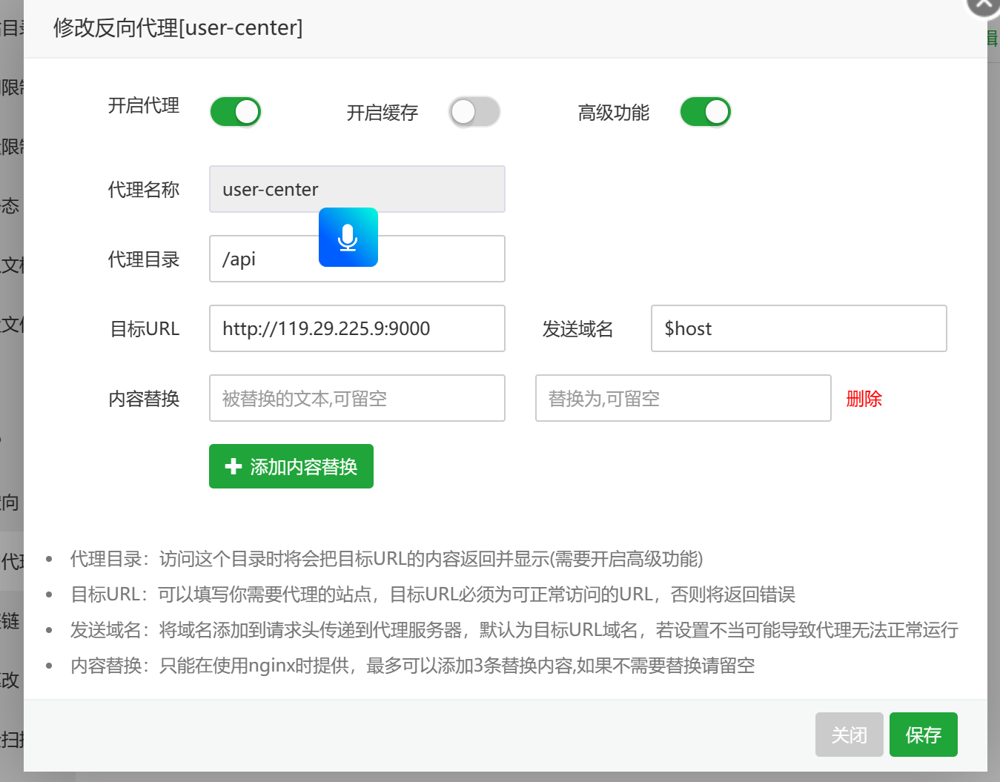
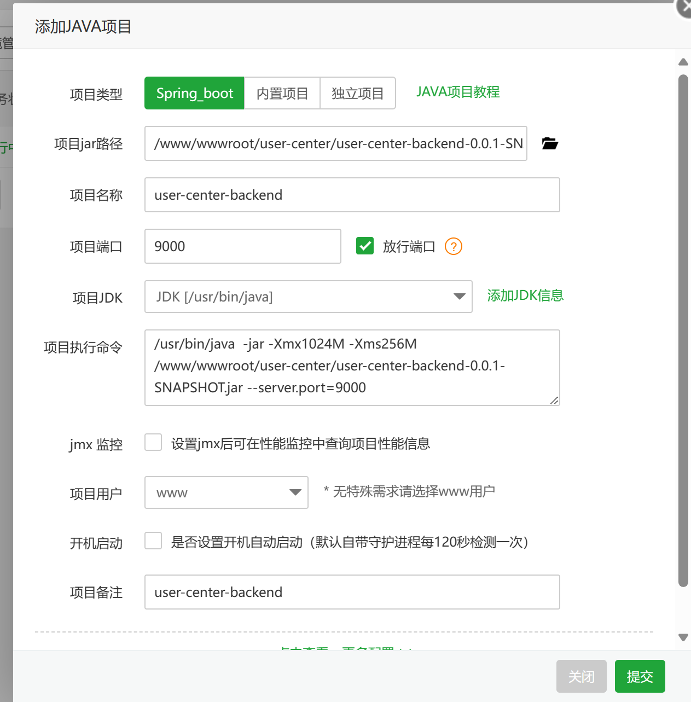

## 准备云服务器（腾讯云）

### 1、使用宝塔安装

#### 宝塔环境配置

1、重装系统，安装应用模版-宝塔Linux面板

2、进入系统，

~~~bash
# 查看bt命令
bt
# 修改登录名
bt 6
# 修改登录密码
bt 5
~~~

3、 进入宝塔页面（ http://119.29.225.9:面板端口/tencentcloud ）

4、取消一键安装，前往软件商店下载nginx、tomcat、MySQL

#### 前端上线

1、修改文件

修改config.ts

~~~tsx
export default defineConfig({
    ...,
    esbuildMinifyIIFE: true,
  requestRecord: {},
  // 添加以下内容，执行静态化打包
    exportStatic: {},
})
~~~

修改app.tsx

~~~tsx
export const request = {
  ...errorConfig,
  timeout: 10000,
  // 添加以下内容，后一个为线上环境
  prefix: isDev ? 'http://localhost:8000': 'http://119.29.225.9:8000',
};

~~~

修改requestErrorConfig.ts

~~~ts
  requestInterceptors: [
    (config: RequestOptions) => {
      // 拦截请求配置，进行个性化处理。
        //修改请求路径
      const url = config?.prefix + config?.url;
      return { ...config, url};
    },
  ],
~~~

2、点击package.json中的build进行打包，生成dist文件

3、将dist目录上传到服务器（/www/wwwroot/user-center)

4、宝塔-》项目-》PHP项目-》添加站点

5、点击该站点设置-》反向代理-》添加反向代理（监听/api，代理至9000端口）

#### 后端上线

1、宝塔添加数据库，设置用户名和密码

2、使用navicat连接该数据库，创建相关的表与数据

3、修改配置文件

新增properties-prod.yml

~~~yml
spring:
  datasource:
    url: jdbc:mysql://119.29.225.9:3306/user-center?useUnicode=true&characterEncoding=utf-8&useSSL=false&serverTimezone=GMT%2B8
    driver-class-name: com.mysql.cj.jdbc.Driver
    username: xxx
    password: xxx
~~~

新增properties-dev.yml

~~~yaml
spring:
  datasource:
    url: jdbc:mysql://localhost:3306/user-center?useUnicode=true&characterEncoding=utf-8&useSSL=false&serverTimezone=GMT%2B8
    driver-class-name: com.mysql.cj.jdbc.Driver
    username: root
    password: 210328
~~~

修改properties.yml(指定使用prod的配置，原本的数据库配置删除)

~~~
...
spring:
  ...
  profiles:
    active: prod
  ...
~~~

4、使用Maven打包成jar包（在target目录下）

5、上传文件至/www/wwwroot/user-center

6、宝塔-》项目-》java项目-》添加java项目，配置如下

#### 部署完成

访问8000端口即可访问